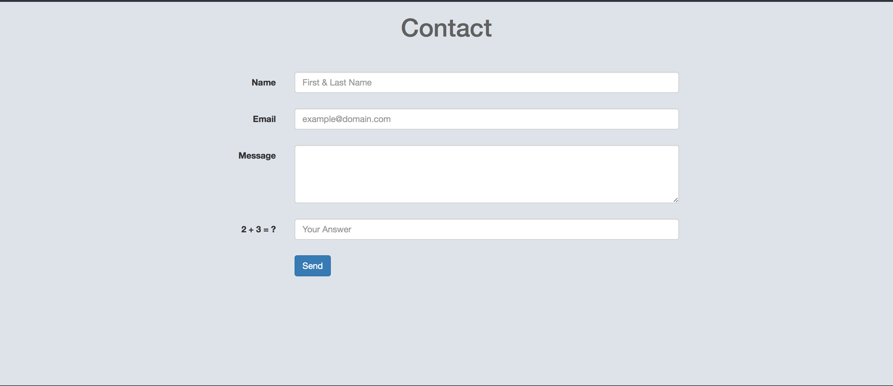

# PHP - Email-Form

A simple example of an email form. Perhaps you've seen this on some personal websites where the owner provides a method to quickly get in touch with them.

The index_email.php file is where the actual html form exists.

The contactform.php file houses the php code used to send an email.
 

<b>WARNING: Be sure to change the value of the $to variable on line 10 in  the contactform.php file. That is the address that the email will be sent to.</b>

These two files must be used in a hosted environment that supports PHP.

 
 

<h3>Example in action</h3>

 
 
<h3>In this example, the submit button was pressed before entering all of the details which displays error messages at all empty fields</h3>

